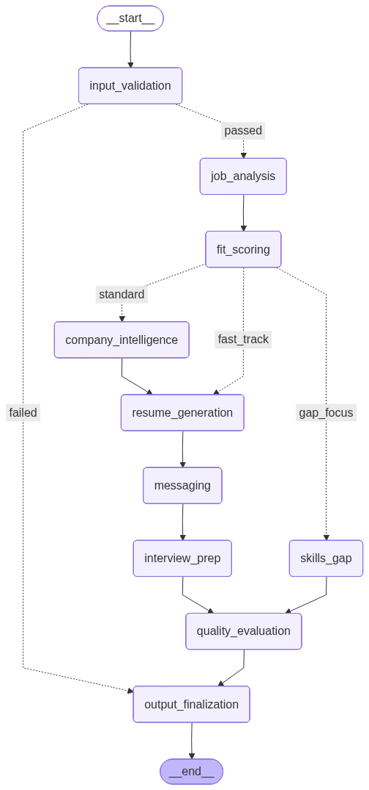

# JobCrew v2: Resilient Multi-Agent Recruitment & Resume Generation Pipeline

JobCrew v2 is a state-of-the-art, multi-provider, resilient agentic workflow designed to automate job analysis, candidate matching, resume tailoring, and interview preparation. Re-architected from the ground up, v2 transitions from an ad-hoc multi-agent system to a robust, deterministic, and traceable state-graph pipeline.

---

## 🏗️ Architecture: Why LangGraph Over CrewAI?

In JobCrew v1, we utilized the CrewAI framework. While CrewAI offers quick agent onboarding, it operates as a black-box, high-abstraction runner. For a production-ready enterprise application, we hit critical limitations:
- **State Management**: CrewAI lacks a centralized, typed state object that flows deterministically through nodes. LangGraph provides a strict, typed `JobCrewState` contract.
- **Granular Control & Pathing**: JobCrew v2 requires complex conditional routing (e.g., Fast-Track resume tailoring vs. Skills Gap analysis vs. Company Intelligence enrichment). LangGraph's support for conditional routing edges based on intermediate state values (like candidate fit score) makes this deterministic.
- **Resiliency & Fallbacks**: CrewAI lacks native, multi-provider fallback orchestration. In JobCrew v2, every LLM call is protected by a fallback chain (Groq ➡️ Gemini ➡️ OpenRouter ➡️ Local Ollama) that catches rate limits (429s) and connection failures without failing the pipeline.
- **Testability**: Individual nodes in LangGraph are isolated functions, making them independently testable with standard mock frameworks.

---

## 📈 Pipeline Visualization

Below is the graph flow representation of JobCrew v2:



---

## 🛠️ Observability & Telemetry

JobCrew v2 is fully integrated with LangSmith for comprehensive system observability. Every graph execution, intermediate prompt, LLM token count, latency, and provider fallback event is tracked.

### LangSmith Trace Example
Below is the structure of a pipeline run trace, demonstrating the parent graph execution and node child spans:

```
[Run: JobCrew Pipeline] (Parent) - Duration: 2.21s
  ├── [Span: input_validation] (Child) - Duration: 0.49s (Provider: System/Heuristic)
  └── [Span: job_analysis] (Child) - Duration: 1.78s (Provider: Groq, Model: llama-3.3-70b-versatile)
```

Each LLM invocation automatically logs its provider telemetry, allowing the system dashboard to analyze cost, latency, and provider reliability metrics.

---

## 🚀 Local Setup & Installation

Follow these steps to set up and run the JobCrew v2 pipeline locally.

### Prerequisites
- Python 3.11 or higher (3.13 recommended)
- Git
- Supabase account (optional, for DB storage)
- Groq / Gemini / LangSmith API Keys

### Step-by-Step Setup

1. **Clone the Repository**
   ```bash
   git clone https://github.com/yourusername/jobcrew.git
   cd jobcrew/jobcrew-v2
   ```

2. **Create and Activate a Virtual Environment**
   ```bash
   python -m venv .venv
   # Windows:
   .venv\Scripts\activate
   # macOS/Linux:
   source .venv/bin/activate
   ```

3. **Install Dependencies**
   ```bash
   pip install --upgrade pip
   pip install -r requirements.txt
   ```

4. **Configure Environment Variables**
   Copy the example environment file:
   ```bash
   cp .env.example .env
   ```
   Open the `.env` file and fill in at least the minimum required keys:
   ```env
   GROQ_API_KEY=gsk_your_groq_key_here
   LANGCHAIN_TRACING_V2=true
   LANGCHAIN_API_KEY=lsv2_your_langsmith_key_here
   LANGCHAIN_PROJECT=jobcrew-v2
   ```

5. **Run Day 1 Validation Script**
   To verify that your environment, folder structure, API keys, fallback provider chain, state compilation, and telemetry are working correctly, execute:
   ```bash
   python validate_day1.py
   ```

   A successful validation will output:
   ```ansi
   ============================================================
   VALIDATION SUMMARY
   ============================================================
   Passed Checks: 10 / 10

   [CONFIRMATION] Day 1 is COMPLETE and Day 2 can begin!
   ```
